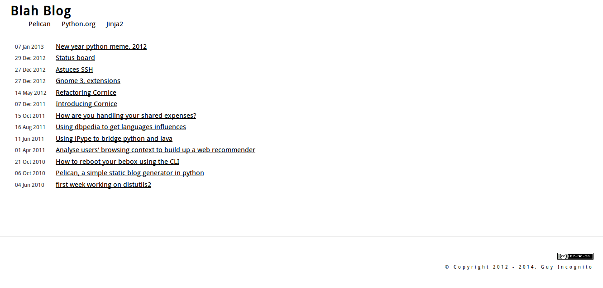
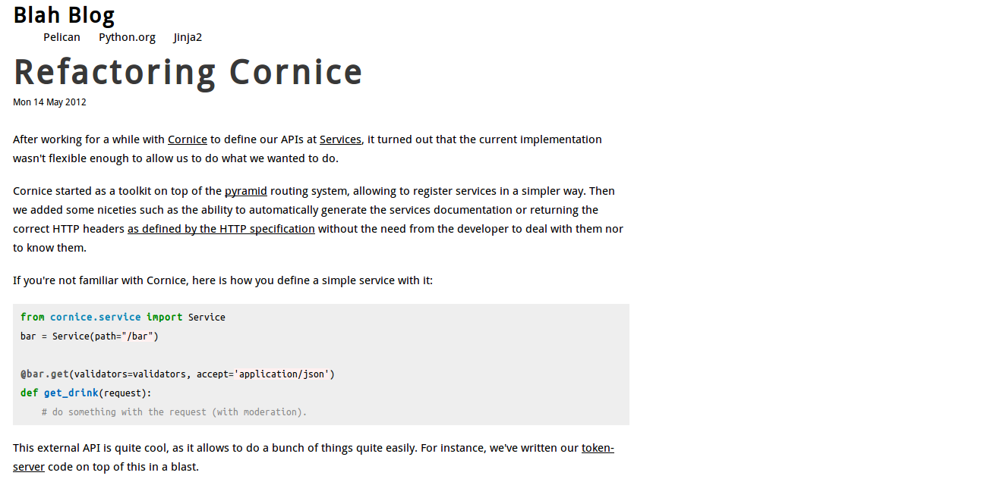

blah theme
==========

`blah theme` is a simple [theme][1] for the Python static site generator
[Pelican][2]. There's not much to it. I developed it for use on my personal
site but feel free to use it as well if you like.

### Custom Settings

A Creative Commons content license, Attribution-NonCommercial-ShareAlike 3.0
Unported, is available for display by simply setting a `COPYRIGHT` string to
display along with the copyright statement. This should be the year of
publication and the copyright holder. Such as:

    COPYRIGHT = "2012 - 2014, Guy Incognito"

Without this no copyright will be displayed. 

If you would like to [choose a different creative commons license][3], it is
easily done by modifying the [`copyright.html`][4] template.

### Screenshots

##### Index

##### Article

* Content for screenshots was generated using Alexis Metaireau's blog. He is
  the creator of Pelican and the original content can be viewed [here][5].

[1]: https://github.com/getpelican/pelican-themes/
[2]: https://github.com/getpelican/pelican/
[3]: http://creativecommons.org/choose/
[4]: templates/copyright.html
[5]: http://blog.notmyidea.org/
